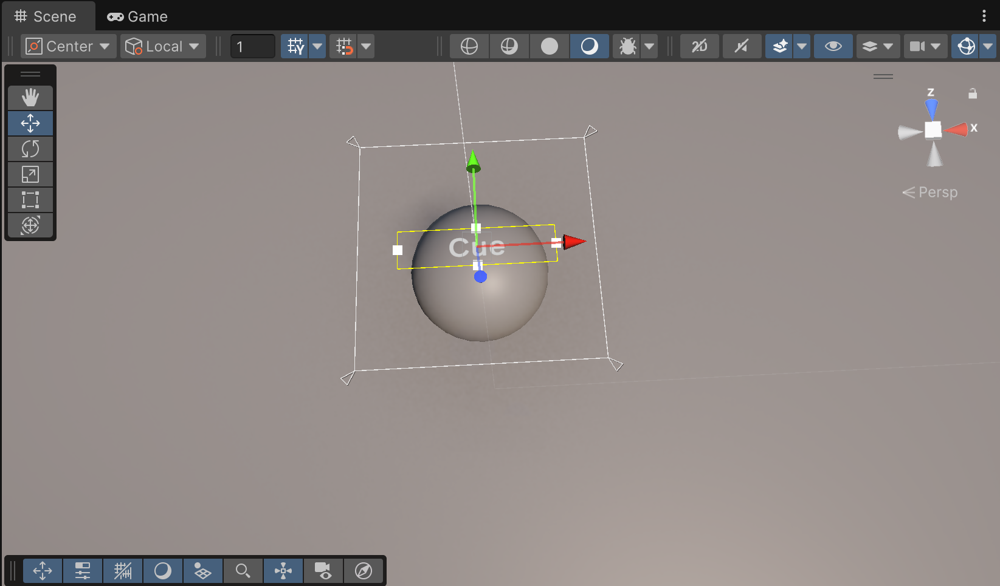

# Unity - UI and Canvas
------
## 본 문서의 작성 시기
> 6000.0 Unity, 수정 시기 6000.2 Unity  

------
------
## TextMeshPro <sub>TMP</sub>를 Canvas 크기만큼 키우고 싶을 때

1. **Hierarchy** 창에서 TMP 오브젝트를 선택하기
2. Inspector > Rect Transform 에서 **Anchor Preset을** `Alt + Shift` \(Pivot과 Position도 적용\)입력한 채로 **전방향 Stretch**
3. **Left, Right, Top, Bottom 모두** `0` 으로 설정

## 이것저것 다 넣은 모듬 팝업(모달)
> 교정해야 할 부분이 있을 거 같다.. 기록할 때 놓친 부분이 있는건지 똑같은 구조에서도 동작하지 않을 때가 있었는데...

모달이나 팝업 따위의 UI에 영상도 사진도 글자도 버튼(그리고 그 안에 또 글자)도 넣고 싶은데 그러면서 정렬이 깔끔하게 되길 원해 여러 시도를 해보았고, 나름의 만족스러운 Hierachy 배치와 Component 구성을 발견하여 기록해두었다.
```Hierachy
Canvas
└ Panel                 ; 모달 배경
  └ Wrapper             ; 영상 담는 오브젝트
  │ └ RawImage          ; 영상
  └ Image               ; 사진
  └ Text (TMP)          ; 글자
  └ Button              ; 버튼
    └ Text (TMP)        ; 버튼 안의 글자
```
Hierachy 구조는 위와 같다. 각 게임오브젝트에 넣을 Component 를 하나씩 설명하려고 한다. 모달 내용을 `Vertical 하게 구성`한다고 가정했다.

### Panel
모달 배경이 될 Panel 에는 다음 Component 를 넣는다:
1. Vertical Layout Group : **Control Child Size** 만 Width와 Height에 체크한다.
   - 다만, Content Size Fitter 에서 Vertical Fit을 설정했다면, Height 옵션은 무시될 것이다.. *아마도.*
2. Content Size Fitter
   - Horizontal Fit : Unconstrained
   - Vertical Fit : Preferred Size

### Wrapper
영상은 `1920 X 1080 (FHD)` 이라 가정한다.
1. Vertical Layout Group : **Control Child Size** 만 Width에 체크한다.

#### Wrapper > RawImage
영상을 넣는 방법은 별도로 서술하지 않았다.
1. Aspect Ratio Fitter
   - Aspect Mode : Width Controls Height
   - Aspect Ratio : 영상의 종횡비에 맞게.. 본인은 그냥 naive하게 1.777 로 썼었다.
2. Layout Element
   - Preferred Width : 영상의 가로 길이
   - Preferred Height : 영상의 세로 길이.. 를 적지만 *아마도* Aspect Ratio Fitter에 의해 무시될 것이다.

### Image
당시 사용한 사진의 크기는 `473 X 498` 이었다.
1. Aspect Ratio Fitter
   - Aspect Mode : Width Controls Height
   - Aspect Ratio : 사진의 종횡비에 맞게.
2. Layout Element
   - Preferred Width : 영상의 가로 길이

### Text (TMP)
없어도 될 거 같다; 확인해본바 차이 없음.
1. Layout Element
   - Flexible Width : 0
   - Flexible Height : 0

### Button
1. Layout Element : 역시 없어도 될 듯
   - Flexible Width : 0
   - Flexible Height : 0
2. Vertical Layout Group
   - 모든 Size|Scale 관련 항목의 Width|Height 를 체크 해제
3. Content Size Fitter
   - Horizontal Fit : Unconstrained
   - Vertical Fit : Preferred Size

#### Button > Text (TMP)
별도로 없음; 화면에 적절하게 표시되게끔 알아서 하자.